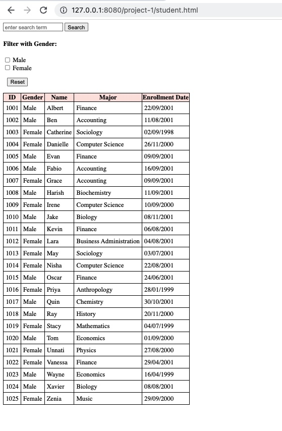
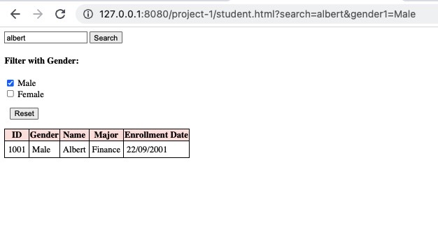

Designed the student.xml file
- The xml file contains the general details of 25 students.
- It has student name, major, and enrollment date (fields), as well as student id and gender (attributes) for each student.

Created the student.xsd file
-  The “students” element is defined as a complex type, because of the presence of the attribute and other elements.
-  The xs:sequence element is used to surround the child elements of the “students” element, in order to define an ordered sequence of sub-elements.
- The elements “student” is  of the complex type.To define the “student” element to appear multiple times inside a “students” element, we will set the maxOccurs attribute of the “student” element to “unbounded”. ]

Created the student.html file
- The html file has an empty table structure having column for each field and attribute of each student item for dynamically loading data from the student.xml file into the table using javascript.
- The table id is student-table.

Ouptut without filter

Output with filter

