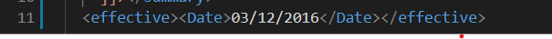
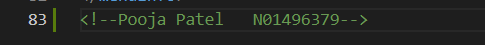
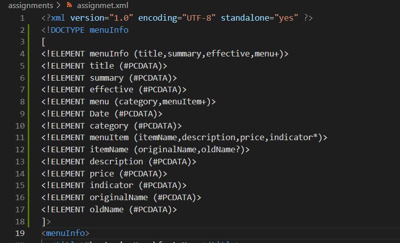
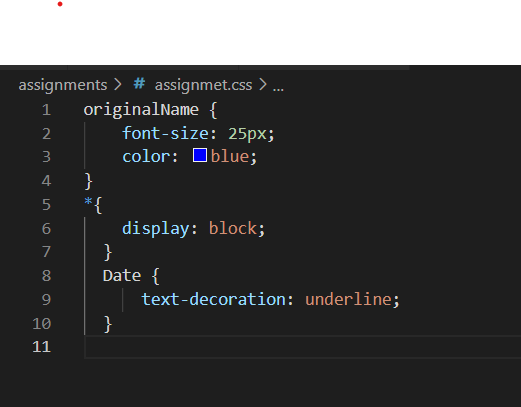
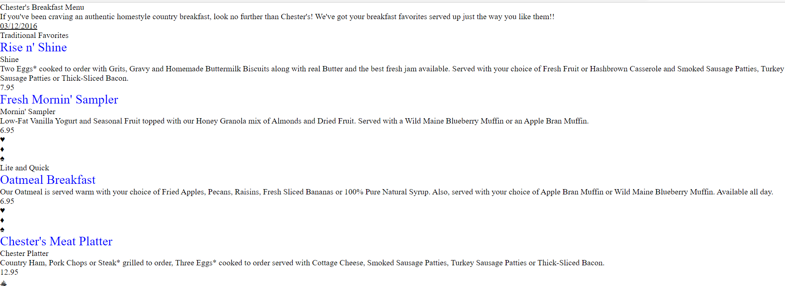

1. There is an error at line 11 which states that value for Date attribute is required per specification.
 
  
2. CDATA block is used here to resolve the mathematical term's inclusion in  XML document.

3. Comment with Student ID and name

4.  - Prolog:   Whatever appears before the document’s root element can be considered as Prolog. XML Prolog includes XML declaration, DOCTYPE and comments, processing instructions too.

 - Document Body:The document body contains the contents in a hierarchical structure.In our document it includes everything between menuInfo and /menuInfo

 - Epilog:The epilog contains final comments and processing instructions. There is no epilog in our xml document.

 - There are no processing instructions in the xml document.

5. Inline DTD

6. XML Validation:

7.   CSS:

