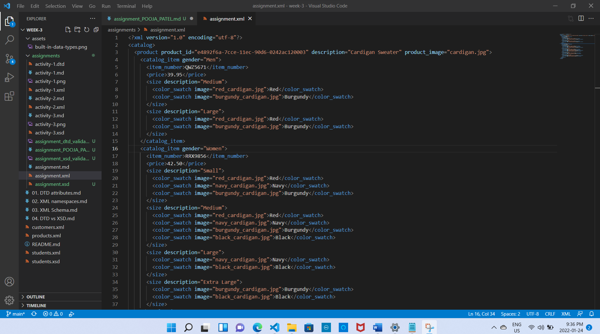
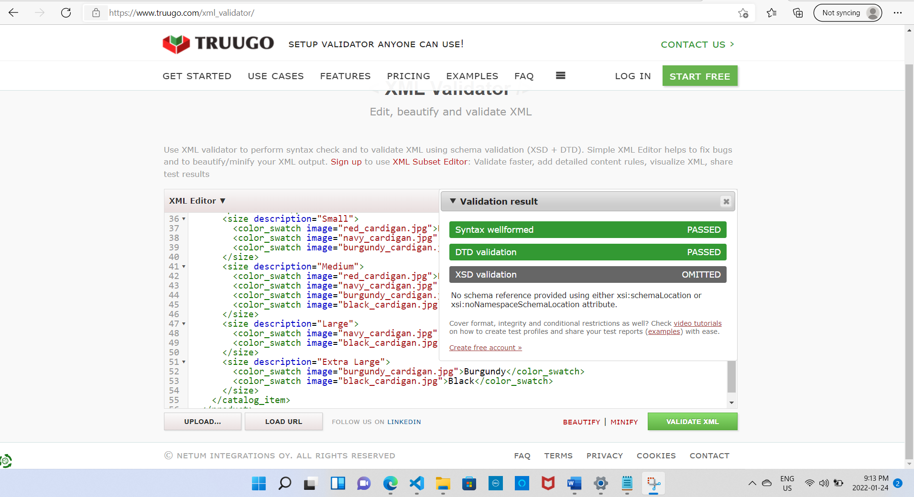
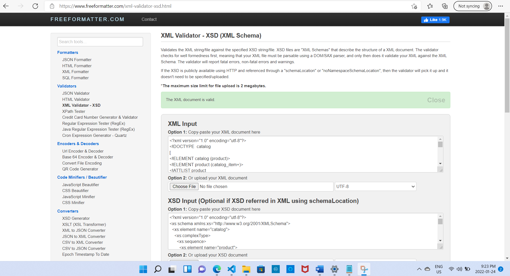

1. Open `week-3/assignments/assignment.xml` in your editor
 
  
2. Create DTD for this file and validate it using any of the tools we used.
 

3. Create XSD for this file and validate it using any of the tools we used

4. Explain your thought process for these 2 declarations.

DTD DECLARATION: 

The DTD specifies the structure constraints for an XML document.External DTDs can be used to create a common DTD that can be used across multiple documents. Any changes to the external DTD are immediately reflected in all documents that reference it.DTD has drawbacks such as inability to support datatypes and namespaces.

XSD DECLARATION:

XSD is more readble than DTD.It supports namespaces and datatypes.It is extensible as it is written in XML. In an XSD file, elements  must have a name and a type.Simple, complex, and custom (user-defined) types are available in XSD.