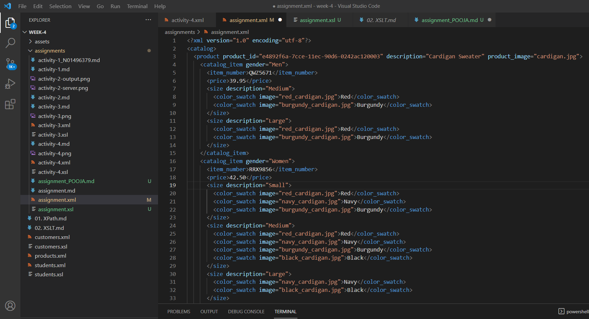
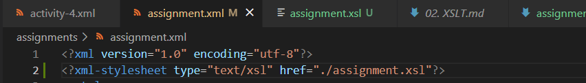
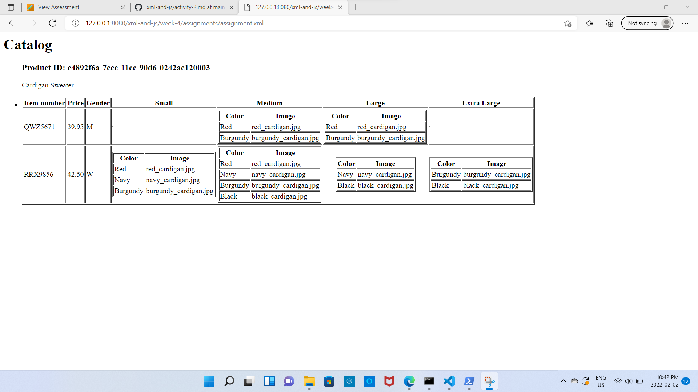

# Assignment

An XSL document specifies how an XML document should be interpreted by a browser.XSLT allows us to transform XML data from one format to another. The stylesheet element needs to be placed in the `http://www.w3.org/1999/XSL/Transform` namespace.The link to the xsl file must be placed as a processing instruction(PI) in the xml document.To view the xsl in our browser we use http-server.xsl:template> specifies a method for reusing templates to generate the desired output for nodes of a specific kind or context. 

The main title"Catalog" and product id is rendered using 'h1' and 'h3' respectively.To display the catalog and every item of 'article'we used the html list tag 'li'.The product description is displayed using paragraph 'p'.To render catalog items we used <xsl:for-each select="//catalog_item"> .By doing this set of nodes to be iterated will be determined by evaluating an XPath expression in the current context.For the gender selection we used `<xsl:if>`that determines the conditional test between nodes.Inside the four size columns we displayed the subtables with two columns: color and image.

STEPS:

1. Open `week-4/assignments/assignment.xml` in your editor

2. Create xsl file and add link to it

3. Display catalog in the following way

- main title is "Catalog"
- use html list tag to display catalog
- render each item as `<article>` inside list item tag
- display product id as h3
- display product description as paragraph
- render table of cataaalog items with columns: item number, price, gender, small, medium, large, extra large (if column item is not present in item, then display empty cell)
- for gender column render M for Men, W for Women
- inside size columns (small, medium, large, and extra large) display subtable with 2 columns: color and image

